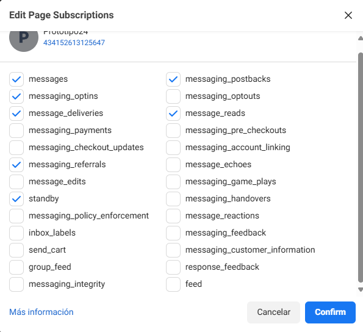
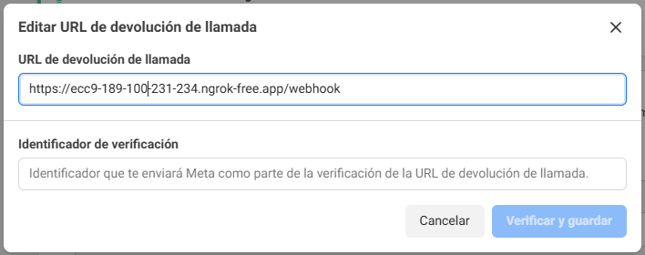

# Configuración de meta developer y meta business.

## META developer.

Se utiliza meta developer para crear la aplicación y poder crear la aplicación del bot, En este mismo apartado se piden los permisos para que el *BOT* interactúe con la *API* de Messenger.
Es muy importante tener los permisos correctamente configurados para que el bot pueda funcionar. En este caso se utilizan los siguientes permisos.


#### Permisos de Meta Developer.



En este mismo apartado de *Configuración de Messenger API* se tiene  el apartado de la configuración del *WEBHOOK*, Es la configuración del *túnel* entre nuestro *BOT* o la aplicación en Python y la *API* de Messenger.
Esto funciona con *Ngrok* y *Flask* para poder exponer el servicio al internet. Configurando una llave de acceso al servicio de *Ngrok* y un *Verify token*, es configurado en el archivo *.env* donde se encuentran los distintos tokens de acceso a los servicios de *Meta* y *Ngrok*. 

#### Ejemplo del archivo *.env*

```python
{
    PAGE_ACCESS_TOKEN=EAAqhLBO6PUxN5cvrZA0NJ4N2DFsxGgkKFmJZAwbUz6uvACR4ZAkNytoGIyOfKiFxsBvaUxNziy5u115HMZBouSHLwlB8NMuESZA1Dd53frLazZCPfiji7prj4s0PnV3S2Vja6pEjqdzfJsHJoYwrcOVm2PJKZBlRH49uRpCjnt0EN8lDwkXwlypBLc1bZC6wZDZD
    VERIFY_TOKEN=Contraseña10
    NGROK_AUTH_TOKEN=2oZqT3u3MeAKjQZILRAvghjxsnjx2CJo7YEq9nHVFX3vqkL96
}
```
> No son accesos reales a los servicios de *Meta* y *Ngrok*, solo son ejemplos practicos para entender como se configuran los distintos tokens de acceso a los servicios de *Meta* y *Ngrok*.

#### Configuración de *Webhook*.



En este apartado se configura la *URL* que da el BOT al iniciar su funcionamiento.

#### Token de acceso a la página.

Es generado por Meta developer cada vez que el *BOT* inicia su proceso, el bot cada vez que inicia cambia su *URL* de *Webhook*.


Con estos 3 pasos se configura la aplicación del *BOT* en *Meta Developer*.

## Meta business.
