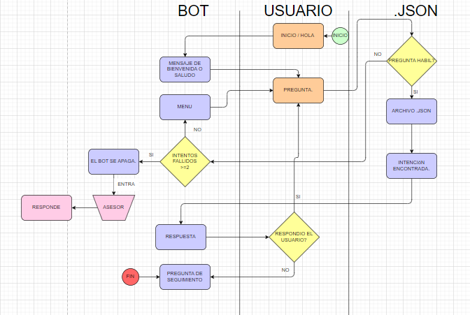
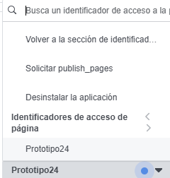

# Objetivo.

La intención de este repositorio es la creación de un BOT de Messenger que pueda responder de manera automática a los mensajes que se le envíen y pueda interactuar con el usuario de manera efectiva, proporcionando la información que se le solicite.

## Creación del repositorio.

Se empezaron a subir todos los archivos creados con anterioridad, incluyendo el **Reporte de prácticas,** que se está modificando diariamente con todos los avances del día.
A sí mismos los **diagramas de flujo** donde se muestran dos de los problemas que se encontraron en el planteamiento del proyecto. Fueron el *"Bucle por directorio no encontrado"* y *"contactar a un asesor"*, en estos dos casos se encontraron soluciones y se han implementado en el proyecto. Con soluciones "sencillas" pero efectivas. Por ejemplo, en el caso del "Bucle por directorio no encontrado", se utilizó un menú en el que el usuario puede seleccionar la opción que satisfaga sus necesidades. En el caso del "contactar a un asesor", se utilizó una intervención de un asesor que se encuentra moderando el chat. Por lo tanto, se puede decir que se han encontrado soluciones efectivas a los problemas encontrados.

##### También se puede encontrar el flujo de trabajo del BOT.

>Diagrama de flujo de como tiene que funcionar el BOT.
##### ¿Cómo funciona el BOT?:
1. El usuario ingresa al chat y el BOT le da la bienvenida.
2. El usuario hace una pregunta o solicita información.
3. El BOT le da la información solicitada o le hace una pregunta para obtener más información.
4. El usuario responde a la pregunta del BOT.
5. En el caso de que la pregunta no esté guardada en las intenciones, el bot muestra el menú de opciones.
6. El usuario selecciona una opción del menú.
7. Si la opción seleccionada sigue sin estar en el conocimiento del BOT, el asesor se encarga de ayudar al usuario.
8. Si el usuario deja de responder, el BOT manda un mensaje de seguimiento después de X tiempo.
[^1]: El tiempo X puede ser configurado por el administrador del BOT. 
[^2]: Ya se encuentran implementadas las soluciones de los casos de uso.


##### Archivo .env

En este archivo se guardarán las credenciales de la página de Messenger, donde se necesitan dos tókenes de acceso.
*Page Access token* y el *verify token*
```bash
PAGE_ACCESS_TOKEN=your_page_access_token
```
Es proporcionado por la plataforma de META developer, donde se configura el *WEBHOOK* y se obtiene el *Page Access Token*.
El *verify token* es configurado por uno mismo en el archivo *.env* y, cuando se haga la *verificación,* la plataforma de META developer lo comparará con el que se encuentra en el archivo *.env* y, si son iguales, se verificará el *WEBHOOK*.

```bash
VERIFY_TOKEN=your_verify_token
```

##### ¿Cómo conseguir el "PAGE_ACCESS_TOKEN"?

* El primer paso es registrarse en *META para desarrolladores*
* En el siguiente paso, debes crear una aplicación en el panel de control de Facebook. 
* Una vez que hayas creado la aplicación, debes ir a la pestaña "Herramientas".
* En la pestaña "Herramientas", debes seleccionar la "Aplicación" y si los permisos son para el usuario o la página.
* En este caso es para la página, por lo que debes de seleccionar.



> El nombre de prototipo debe de cambiar al nombre de la pagina que deseas que el bot interactue con.

##### Pruebas de la aplicación.

Para poder ejecutar la aplicación correctamente, se necesita de un entorno de ejecución adecuado. Para ello, se intentó utilizar una máquina virtual con Linux, específicamente con la distro Debian.
Donde se tienen que instalar todas las librerías y dependencias que se están utilizando

##### Configuración de Debian.

Teniendo la USB booteada con la imagen de Debian, se tiene que configurar el nombre que tiene la máquina y cómo va a salir el nombre del servidor.
Con el sistema operativo ya funcionando, se tiene que agregar el usuario para que sea *Superusuario*. Tener los beneficios de *Superusuario* permite la actualización de los paquetes y todas las dependencias que utiliza el **sistema operativo**.

```bash

Sudo su 
```
*Se ingresa la contraseña y ahora se encuentra en modo superusuario*
```bash
sudo adduser username
```
Con esto se crea un nuevo usuario con todos los permisos de superusuario.
>en *username* se ingresa el nombre del usuario que se quiere crear.

>Esto es necesario para poder actualizar los paquetes y dependencias del sistema operativo y podr instalar las nuevas librerias.

##### Configuración de la máquina.
1. Instalar Debian en el servidor.
>Una vez instalado, se tienen que actualizar todos los paquetes.
```bash
sudo apt update && sudo apt upgrade -y
```
2. Configuración de la IP.
>Se tiene que configurar la ip del servidor.
```bash
sudo nano /etc/network/interfaces
 ```
 >Se tiene que modificar la dirección, máscara y gateway dependiendo de la IP que se tenga.
```bash
auto eth0
iface eth0 inet static
    address 192.168.1.100
    netmask 255.255.255.0
    gateway 192.168.1.1
    dns-nameservers 8.8.8.8 8.8.4.4
```
```bash
sudo systemctl restart networking
```
3. Instalar Python.
```bash
sudo apt update
sudo apt install -y python3 python3-venv python3-dev
```
4. Instalar el framework de Flask.
```bash
pip install flask
```
5. Instalar pip.
```bash
sudo apt update
sudo apt install -y python3-pip
```
6. Instalar ngrok.
```bash
wget https://bin.equinox.io/c/bNyj1mQVY4c/ngrok-stable-linux-amd64.zip
unzip ngrok-stable-linux-amd64.zip
sudo mv ngrok /usr/local/bin
```
>Autentica ngrok (cambia <YOUR_AUTH_TOKEN> por tu token de autenticación):
```bash
ngrok authtoken <YOUR_AUTH_TOKEN>
```
7. Instalar supervisord o systemd.
```bash
sudo apt update
sudo apt install -y supervisor
```
8. Configurar el firewall (ufw para flask).
> Es muy importante instalar de manera correcta el entorno de ejecución del BOT.
##### Librerías necesarias.
1. Spacy.
2. JSON.
3. Datetime.
4. Difflib.
6. Flask.
7. Ngrok.
8. Supervisord o systemd.
> Se agregaran mas si es el caso.

# Problemas en el entorno de ejecución y en las pruebas.

Se están realizando pruebas en el entorno de ejecución y se han encontrado los siguientes problemas:
>los cuales son bastantes y todavia no se encuentran las soluciones.
1. Conflictos en el entorno de desarrollo.
2. Configuración errónea en el *WEBHOOK*.
3. Problemas en el firewall.
4. Verificación necesaria.

### El problema encontrado en el código. 

Fue que se repetían las variables en el manejo de las *Requests* a la hora que entraban los mensajes en el chat, el *Túnel* creado con *NGROK* que se expone el servidor públicamente.
El problema encontrado puede resultar en muchas cosas, como se explicó anteriormente. Estos problemas se podrían solucionar al momento de ejecutar el código en el servidor.
Al momento de probar el *WEBHOOK* para crear el túnel con *NGROK* *META* si mando correctamente la petición a *NGROK*, en el momento de mandar una petición *(Mensaje)* desde Messenger, No llega la petición al *BOT*.
